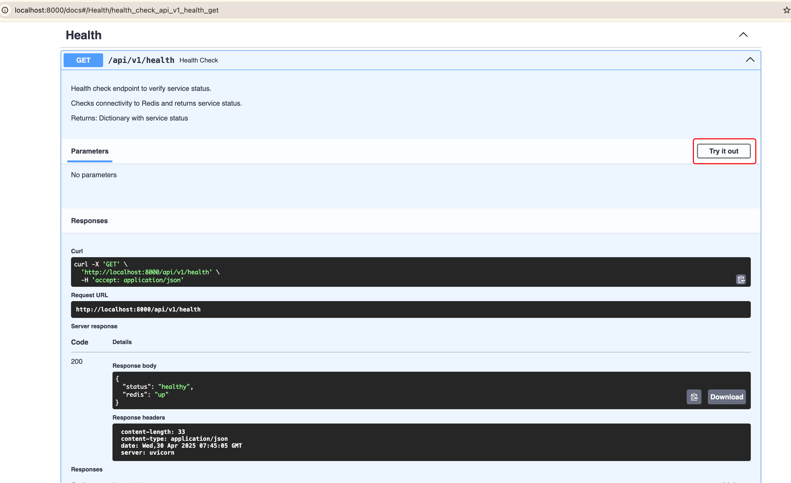

# Video Processing & Web Scrapping Service

A modern Python service for video generation and web scraping with caching built on FastAPI.

## Features

- **Video Generation**
  - Create videos with customizable text overlay
  - Generate videos with animated text moving from top-left to bottom-right
  - Parallel video processing using ProcessPoolExecutor
  - Font handling with fallback support

- **Web Scraping**
  - Scrape and cache trending science news
  - Redis-based caching with configurable TTL

- **Architecture**
  - Async/await throughout the codebase
  - Redis for fast caching
  - Process pool for CPU-intensive operations
  - Dependency injection with container
  - Comprehensive error handling

## System Architecture

This service follows clean architecture principles with dependency injection:

```
app/
├── api/            # API endpoints and routes
│   ├── dependencies.py      # Dependency injection setup
│   └── routes/             # Route modules for endpoints
│       ├── health.py       # Health check endpoints
│       ├── trending.py     # News scraping endpoints
│       └── video.py        # Video generation endpoints
├── core/           # Core functionality and configuration
│   ├── config.py           # Application settings
│   ├── decorators.py       # Error and timing decorators
│   ├── exceptions.py       # Error handling
│   └── moviepy_config.py   # Video processing config
├── services/       # Business logic services
│   ├── cache/              # Caching implementation
│   │   └── redis_cache.py  # Redis-based cache
│   ├── scraper/            # Web scraping logic
│   │   └── science_news_scraper.py  # Science news scraper
│   └── video/              # Video processing
│       └── video_processor.py  # Video generation service
└── main.py         # Application entry point
```

### Parallelization Strategy

- Uses `ProcessPoolExecutor` for CPU-bound video processing
- Worker count optimized for CPU tasks
- Tasks run in isolated processes to avoid GIL limitations

## Setup

### Preview

Here are examples of videos generated by the service:




### Prerequisites

- Docker and Docker Compose
- Make (optional, for convenience commands)

### Running the Service

1. Clone the repository
2. Start the service:

```bash
make up
```

This will:
- Build the Docker images
- Start the application and Redis containers
- Make the API available at http://localhost:8000

### Stopping and Cleaning Up

To stop the service and clean up generated files:

```bash
make down
```

This will:
- Stop all containers
- Remove associated volumes
- Clean up generated video files from `app/media/output/`

```bash
make test
```
This will:
- run all tests


### API Documentation

Once the service is running, view the API documentation at:

- http://localhost:8000/docs (Swagger UI)

## API Endpoints

### Video Generation

- `POST /api/v1/generate-video`: Create a video with custom text and parameters
  ```json
  {
    "text": "Your text overlay here",
    "duration": 5.0,
    "text_position_x": 50,
    "text_position_y": 150,
    "text_start": 1.0,
    "text_end": 5.0,
    "font_size": 30,
    "text_color": "white"
  }
  ```

- `POST /api/v1/animate-text-video`: Create a video with text animating from top-left to bottom-right
  ```json
  {
    "text": "Your animated text here",
    "duration": 5.0,
    "font_size": 30,
    "text_color": "white"
  }
  ```

- `GET /api/v1/videos/{filename}`: Retrieve a generated video
  - Provide the video filename (including .mp4 extension) to download the file
  - Example: `GET /api/v1/videos/video_ef5bb85aa7ac46cda6ffe47e622485a4.mp4`
  - Returns the video file as a streamable response
  - Raises HTTPException with 404 status if the file is not found

### Web Scraping

- `GET /api/v1/trending-news`: Get trending news from Science News Magazine (cached for 10 minutes)
  - Optional query param: `refresh=true` to force fresh data

### Health Check

- `GET /api/v1/health`: Service health check with Redis status

## Video Output

Generated videos are stored in the `app/media/output/` directory and are accessible via the API. The container mounts this directory as a volume:

```yaml
volumes:
  - ./app/media/output:/app/app/media/output
```

This allows video files to persist across container restarts and be accessible from the host system.

## Font Setup

- Custom fonts can be added to the /app/media/fonts/ directory and configured via the FONT_PATH environment variable.

## Font Fallback System

- The service intelligently merges custom fonts with system fonts to handle missing characters across all languages and scripts (including CJK, Arabic, and Cyrillic). This premerging technology ensures text renders correctly with consistent styling regardless of the Unicode characters used.


## Docker Environment

The service is containerized with Docker:

- Python 3.11 base image
- Redis for caching
- Proper setup for MoviePy and ImageMagick
- Volume mounting for persistent storage

### Environment Variables

Customize the service with these environment variables:

| Variable | Description | Default |
|----------|-------------|---------|
| `REDIS_HOST` | Redis server host | `redis` |
| `REDIS_PORT` | Redis server port | `6379` |
| `MAX_WORKERS` | Process pool size | CPU count |
| `CACHE_TTL` | Cache TTL in seconds | `600` |

## Development

### Project Structure

The project follows a modular structure with clear separation of concerns:

- **API Layer**: FastAPI routes and endpoints
- **Service Layer**: Business logic components
- **Core**: Configuration, error handling, and shared utilities
- **Dependencies**: Centralized dependency injection

### Key Design Patterns

1. **Decorator-Based Error Handling**
   - Centralized error transformation
   - Consistent error response format
   - Automatic logging

2. **Async Throughout**
   - Async Redis client
   - Async web scraping
   - Async API endpoints

3. **Resource Management**
   - Proper initialization and cleanup
   - Graceful shutdown handling

4. **Performance Monitoring**
   - Timing decorators for key operations
   - Detailed logging

### Libraries and Dependencies

This project uses the following Python libraries:

**Core Framework**

- FastAPI: Provides the API layer with async support, automatic OpenAPI documentation, and dependency injection.
- Uvicorn: ASGI server that powers our FastAPI application.
- Pydantic: Handles data validation and settings management throughout the application.

**Video Processing**

- MoviePy: Handles all video generation, including creating videos with text overlay and animations.
- Pillow: Used for background image creation and manipulation.

**Web Scraping and Caching**

- BeautifulSoup4 with lxml: Parses HTML from Science News for trending article extraction.
- aiohttp: Makes async HTTP requests for web scraping.
- redis.asyncio: Provides async Redis interface for caching scraped content.

**Architecture**

- dependency-injector: Implements dependency injection for cleaner code organization and testability.

**Testing**

- pytest & pytest-asyncio: Testing framework with async support for unit testing.

### Available Commands

- `make build`: Build Docker images
- `make up`: Start services
- `make down`: Stop services and clean up generated files
- `make logs`: View service logs
- `make clean`: Clean up containers and media
- `make test`: Run tests
- `make shell`: Open a shell in the app container
- `make help`: Show available commands

## Contributing

1. Fork the repository
2. Create a feature branch (`git checkout -b feature/amazing-feature`)
3. Commit your changes (`git commit -m 'Add some amazing feature'`)
4. Push to the branch (`git push origin feature/amazing-feature`)
5. Open a Pull Request

## License

MIT

## Future Improvements

- User authentication and API keys
- Additional video templates and effects
- Thumbnail generation for videos
- Queue system for long-running video tasks
- Metrics dashboard for system performance